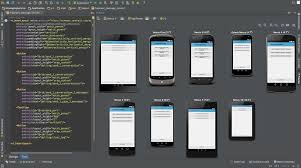

# Week 1 Android Studio

This is the 1st of a series of 11 excercises of Module 387 at Coventry University. Thease excercises are designed to expose different aspects of Android programming to 3rd year Computer Science/Multimedia Computing students here at Coventry.

## Lab 1 Introduction to Android Studio

'Hello World', Installation of Java JDK/Android Studio, navigating Android Studio,Context Menus, getting help, Code generation, Git

### Installation

I want to insert an image here

### Hello world!

**Contents**

**Refs**

### Android Studio guided tour

### Difference between Android and iOS

[Ref.[1]](#ref1) chapter 1/2/3/7

## Lab 2 Debugging

AVD, common operations, refactoring, logging, debugger's tool window

### Git

### Intents

### Debug

**Contents**

**Refs**

[Ref.[1]](#ref1) chapter 4/12

## Lab 3 Advanced topics

### Command line tools

### Design principles

### More Git

## Reading list

1. [Learn Android Studio](http://www.amazon.co.uk/Learn-Android-Studio-Quickly-Effectively/dp/1430266015)
2. [Learn Java for Android Development](http://www.amazon.co.uk/Learn-Java-Android-Development/dp/1430264543)
3. [Android Apps for Absolute Beginners](http://www.amazon.co.uk/Android-Absolute-Beginners-Wallace-Jackson/dp/1484200209)
4. [Beginning Android 4 Application Development](http://www.amazon.co.uk/Beginning-Android-4-Application-Development/dp/1118199545)
5. [Introduction to Android Application Development](http://www.amazon.co.uk/Introduction-Android-Application-Development-Essentials/dp/0321940261)
