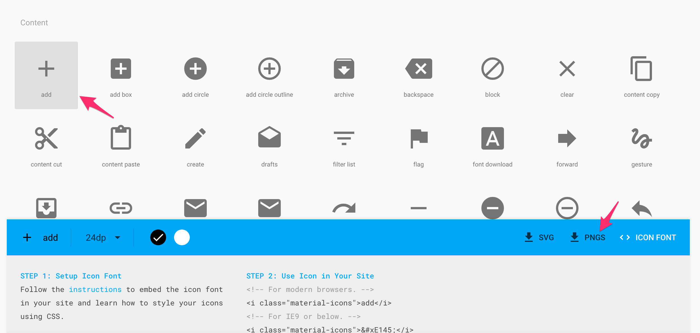

# XML and gradle

Many of you have used virtual machines such as VMware Workstation Player or VirtualBox where one can setup several vitual operating systems in parallel on a solid single machine. In fact, the Android system use some similar technologies. In Android, each app runs within its own virtual machine a.k.a. sandbox. The Android system treats different apps as different 'users', hence they need permissions to access sensors etc. 

In order to produce functional apps, we need to design front-end GUI layouts and back-end actions. We also need to define app-level entry point and permissions etc. Eventually, all these are packed into an apk archive that goes to Google Play store, and then onto your users' screen:

XML (.XML) ==> Java (.JAVA) ==> ByteCode (.DEX) ==> App (.APK) ==> Runtime (DVM ) ==> Screen

## Lab 1 XML

First, we look at how to provide and access resources such as layouts and themes use XML. You have used XML to design your apps previously, now we'll examine again in more details.

### Checkout a Git repository

The current excercise is based on a previous project called 'My Car'. If that project is not available on you hard drive, you need to do the following to download:

1. Open a terminal window and navigate to the location where you want to save it. Then issue the following command to clone the whole repository into your harddrive `git clone https://github.com/covcom/388COM.git`. Alternatively, go to https://github.com/covcom/388COM, click 'Download Zip' to download the whole repository. 
    
    Once downloaded, un-zip and location the 'My Car' project under 'Week_02' folder. You might want to copy the project to somewhere handy for you.
    
    
    
    Alternatively, open a terminal window and navigate to the location where you save it. Then issue the following command `svn checkout https://github.com/covcom/388COM/trunk/Week_02_The_Java_language/MyCar`. You'll see that the project is downloaded into the folder you have chosen.
    
    
    
2. Rename the folder from 'MyCar' to 'MyXml', and then open it using Android Studio.
    
    Once opened, you can see in the title bar the project name has been changed. This can also be verified if you open the file called '.name' under (Project mode) ==> .idea ==> .name
    
    
    
3. Right click anywhere within the Project tool window, click Open Module Settings. Go to the Flavors tab, change Application Id from 'com.example.jianhuayang.mycar' to 'com.example.jianhuayang.myxml'
4. Double click to open the string resource file, change app_name from 'My Car' to 'My Xml'.
    
    
    
5. Locate the long package name 'com.example.jianhuayang.mycar' under Java folder, right click on it, select Refactor ==> Rename. In the small windows that pops up, type in 'myxml'. A tool windows called 'Find Previw' will show, click 'Do Refactor'.
6. From the menu bar, select Build ==> Clean Project, and then from the menu bar select File ==> Syncrhonize. This should clear out traces of the old project.
7. To verify that you don't have anything in this current projects that relates to 'mycar' or 'my car', in the project tool window, right click on app, then select Find in Path. Type in mycar, and hit enter. You'll see that indeed there's one occurance of 'MyCar'. Change it to something like 'MyXml'.
    In stead of using 'Find in Path', what you could do is to use 'Search Everywhere'. This is available if you hit 'shift' key twice.
    
    


### XML basics - layouts

Open content_main.xml under app ==> res ==> layout folder. You have seen this layout file quite a few times already. Now let's have a closer examination of it.

1. The very first line of the file i.e. `<?xml version="1.0" encoding="utf-8"?>` is called a prolo. It defines xml version and encoding. The prolog is optional. If it exists, it must come first in the document. This is automatically generated by Android Studio and you don't need to touch it.
2. The second line of the xml defines a container layout called LinearLayout. This corresponds to a class called LinearLayout. In fact, all we do here in the xml file can be done in Java source codes. But probably xml is easier as it's more visual. 
3. In xml, all tags come in pairs. If you look down the file, you'll see the closing tab of LinearLayout i.e. `</LinearLayout>` towards the end of the file. This is for container layouts where other elements can be contained in it. For layouts such as Button you'll need to close the tag using `/>`.
4. xml is case sensitive. If you use linearLayout at where LinearLayout is expected, the system will complain.
5. xmlns stands for xml namespace. The purpose of namespace in xml standard is to avoid conflicts. For example, in the current file the word 'android' is set to be 'http://schemas.android.com/apk/res/android'. When the system parse the file, where it sees the word android it'll  replace it with this long string. 
6. For Android, the namespace refers to http://schemas.android.com/apk/res/android, which is a URI (NOT URL). This cannot be changed.
7. Attributes are required by the Java class to initilize the GUI on your screen. Note here although you use words such as 'wrap_content' or 'match_parent', these will later on be substituted with constants. For example wrap_content is equal to -1.
    
    > Click [here](http://developer.android.com/reference/android/view/ViewGroup.LayoutParams.html) for a list of layout parameters.
    
8. In the project tool window, under 'res' folder there're several different sub-folders apart from layout, such as menu and values. We'll have a look at these during the rest of this week's lab.
    
    > [XML Syntax Rules from w3school](http://www.w3schools.com/xml/xml_syntax.asp). Note this is for xml in general.

### Dimensions, strings, images, menus, and integer

First, we need to re-design the interface by removing some 'hard-coded' values, and we'll add some more elements onto the UI.

1. In content_main.xml locate one occurance of 800dp and double click on it. This word should now be highlighted. On the menu bar, click Edit ==> Find ==> Replace. A small window will pop up that has already had 800dp filled in on the upper textfield. In the lower textfield type 'match_parent', and then hit Replace all.
2. Open dimens.xml, insert the following into the file.
    
    ```xml
    <dimen name="margin_left">19dp</dimen>
    <dimen name="margin_top">5dp</dimen>
    <dimen name="margin_right">20dp</dimen>
    ```
    Here dp stands for density-independent pixels, which is a unit of measurement for UI elements. We typically use sp (scale-independent pixels) for font sizes, and dp for everything else. Refer to [here](http://developer.android.com/guide/topics/resources/more-resources.html#Dimension) for a thorough explanation of different units avaiable in Android.
3. Go back to content_main.xml, replace '19dp' with '@dimen/margin_left', '20dp' with '@dimen/margin_right', '10dp' with '@dimen/margin_top'. There're still two 'hard-coded' dp values in this layout file. Locat these two and substitute with '@dimen/margin_top'. Your screen should look at the following right now.
    
    
    
4. Open strings.xml, insert the following in between `<resources>` tags.
    
    ```xml
    <string name="button_car">Create car</string>
    <string name="button_diesel">Create diesel</string>
    ```
    Go back to content_main.xml, replace `android:text="Run Petrol"` with `android:text="@string/button_car"`. In the same way, replace `android:text="Run Diesel"` with `android:text="@string/button_diesel"`.
5. Insert the following into the content_main.xml file, just before the inner LinearLayout. Now that you have two more EditTexts on your screen.
    
    ```xml
    <TextView
    android:id="@+id/labelValue"
    android:layout_width="wrap_content"
    android:layout_height="wrap_content"
    android:layout_marginLeft="@dimen/margin_left"
    android:layout_marginTop="@dimen/margin_top"
    android:text="Puchase price (£):"
    android:textAppearance="?android:attr/textAppearanceSmall" />
    
    <EditText
    android:id="@+id/inputPrice"
    android:layout_width="match_parent"
    android:layout_height="wrap_content"
    android:layout_marginLeft="@dimen/margin_left"
    android:layout_marginRight="@dimen/margin_right"
    android:ems="10"
    android:hint="e.g. 35,000"
    android:inputType="number" />
    
    <TextView
    android:id="@+id/labelEngine"
    android:layout_width="wrap_content"
    android:layout_height="wrap_content"
    android:layout_marginLeft="@dimen/margin_left"
    android:layout_marginTop="@dimen/margin_top"
    android:text="Engine size (litre):"
    android:textAppearance="?android:attr/textAppearanceSmall" />
    
    <EditText
    android:id="@+id/inputEngine"
    android:layout_width="match_parent"
    android:layout_height="wrap_content"
    android:layout_marginLeft="@dimen/margin_left"
    android:layout_marginRight="@dimen/margin_right"
    android:ems="10"
    android:hint="e.g. 1.4"
    android:inputType="numberDecimal" />
    ```
    
    Insert the following TextView just after the inner LinearLayout.
    
    ```xml
    <TextView
    android:id="@+id/textBlock"
    android:layout_width="match_parent"
    android:layout_height="0dp"
    android:layout_marginBottom="10dp"
    android:layout_marginTop="@dimen/margin_top"
    android:layout_weight="1"
    android:background="?android:attr/colorActivatedHighlight"
    android:scrollbars="vertical" />
    ```
    At this point your layout should look like this
    
    
    
6. Go to the following address https://www.google.com/design/icons/index.html#ic_add, and click PNGS to download the 'add' icon. In the same way, download the 'minus' icon at https://www.google.com/design/icons/index.html#ic_remove.
    
    
    
7. Extract the zip file you just downloaded, go into the android folder in it. You'll see a set of folders whoes names begin with drawable. Copy all drawable folders and paste into MyXml/app/src/main/res. Repeat for both icons you downloaded. If the system asks whether you want to merge file, just merge.
    
    Now your res folder should look like this
    
    
    
    If you go back to Android Studio, in the project tool window, the two icons have been added automatically
    
    
    
8. Open menu_main.xml, insert the following in between `<menu>` tags.
    
    ```xml
    <item
    android:id="@+id/menu_add"
    android:icon="@drawable/ic_add_black_24dp"
    android:orderInCategory="1"
    android:title="@string/menu_add"
    app:showAsAction="always|withText" />
    <item
    android:id="@+id/menu_clear"
    android:icon="@drawable/ic_remove_black_24dp"
    android:orderInCategory="10"
    android:title="@string/menu_clear"
    app:showAsAction="ifRoom" />
    ```
    You'll see immediately that some texts are highlighted in red. This is because the two string resources we are refering to are not available. Add the following to the string resource file.
    
    ```xml
    <string name="menu_add">Add to list</string>
    <string name="menu_clear">Clear list</string>
    ```
    There're several things to note on the menu item attributes above:
        * oderInCategory set the appearance order of that menu item -- smaller values appear first. For English that is on the left handside. 
        * namespace app is for older versions of Android, as showAsAction is not available on those systems. Click [here](http://developer.android.com/training/basics/actionbar/adding-buttons.html) for more info on this. 
        
9. Insert the following into strings.xml in between `<resources>` tags.
    
    ```xml
    <integer name="depreciation">80</integer>
    ```

### ArrayList, StringBuilder, Wrapper class, auto boxing

Make the following changes to the 'basic' classes to accomodate the UI change.

1. Open Vehicle.java and insert two new member variables and generate getter methods for both.
    
    ```java
    private int price;
    private double engine;
    ```
2. Change the constructor that takes two input parameter, make it take all four instead.
    
    ```java
    public Vehicle(String make, int year, int price, double engine) {
    this.make = make;
    this.year = year;
    this.price = price;
    this.engine = engine;
    this.message = "Your car is a " + make + " built in " + year + ".";
    count();
    }
    ```
    
3. Generate a getter method for member variable 'make'.
4. Open Car.java, change Car constructor to
    
    ```java
    public Car(String make, int year, String color, int price, double engine){
    super(make, year, price, engine);
    this.color = color;
    setMessage(getMessage() + " I like your shining " + color + " color.");
    }
    ```
    
    Change Diesel constructor to 
    ```java
    public Diesel(String make, int year, int price, double engine){
    super(make, year, price, engine);
    this.type = "Diesel";
    }
    ```
5. Change Car and Diesel initialization methods in ActivityMain.java to accommodate new variables. Your switch block should now look like this
    
    ```java
    switch (view.getId()) {
        case R.id.buttonRunPetrol:
            vehicle = new Car(make, intYear, color, price, engine);
            break;
        case R.id.buttonRunDiesel:
            vehicle = new Diesel(make, intYear, price, engine);
            break;
        default:
            vehicle = new Vehicle();
            break;
    }
    ```
    
    Now both constructors are capable of handling the new fields in the UI.

Next, we need to make some changes to MainActivity.java to handle menu button click and display message back to our users.

1. Declare variables that correspond to new UI element. These should be put together with declarations that are already in the class.
    
    ```java
    private EditText editTextPrice;
    private EditText editTextEngine;
    private TextView textViewBlock;
    ```
    
    Declear a Vehicle object for the current vehicle on the screen, an ArrayList that holds Vehicles the user has added through menu, and a couple of other helper variables.
    
    ```java
    private Vehicle vehicle;
    // the diamond syntax because the empty angle brackets have the shape of a diamond, "core java for the impatient" C. Horstmann
    // remove '\' in the code below, it's for the current document only due to formatting issues
    private ArrayList\<Vehicle> vehicleList = new ArrayList<>();
    private StringBuilder outputs;
    private static Double depreciation;
    ```
    
    There're some new classes that you haven't seen before:
    
    * In Java, arrays are initialized with a fixed size. For example, `int[] aVariable = new int[10]` will declare an integer array called aVariable of size 10. But the problem is if later on you have more than 10 elements, it won't fit into this array, The way to get around this is to use the **ArrayList** class from java.util package. The ArrayList class extends AbstractList and implements the List interface. In the declaration above, in between angle brackets are types you want to hold using this ArrayList, in our case this is Vehicle class. 
    * In Java, String objects are immutable. 'Immutable' here means once assigned the string itself cannot be changed. For example, consider the following, this is possible in Python but not in Java. To get around this, Java introduced **StringBuilder** class, which is effectively a String class with mutable strings. We'll see how to use it later on.
    
    
    
    > For discussions on when to use String and when to use StringBuilder, click [here](http://stackoverflow.com/questions/4645020/when-to-use-stringbuilder-in-java)
    
    * You have seen primitive data types such as int or double. In the codes above I used Double, which is not to be confused with double. Double here is a **wrapper class** for the primitive type double (there's also Integer for int etc.). The main reason that we need these wrapper classes is that these are objects, while primitive types are not. For example, we can declare `ArrayList<Double>` but we cannot declare `ArrayList<double>`.
        
        Wrapper class can be initialized using *proper* object initialization methods using keyword 'new'. For example, `Double  a = new Double(100.00)`. Or it can be initialized like an ordinary primitive type, e.g. `Double  a = 100.00`. This is called **autoboxing**. By definition, autoboxing refers to the automatic conversion that the Java compiler makes between the primitive types and their corresponding object wrapper classes.
    > For discussions on when to use primitive types and when to use wrapper classes, click [here](http://stackoverflow.com/questions/423704/int-or-integer/423718#423718)
    
2. Initializatin of these variables was inside method `onButtonClick`, you need to move it to `onCreate`. Also insert initialization of new UI element. Your `onCreate` method should now look like this
    
    ```java
    @Override
    protected void onCreate(Bundle savedInstanceState) {
        super.onCreate(savedInstanceState);
        setContentView(R.layout.activity_main);
        Toolbar toolbar = (Toolbar) findViewById(R.id.toolbar);
        setSupportActionBar(toolbar);

        editTextMake = (EditText) findViewById(R.id.inputMake);
        editTextYear = (EditText) findViewById(R.id.inputYear);
        editTextColor = (EditText) findViewById(R.id.inputColor);
        editTextPrice = (EditText) findViewById(R.id.inputPrice);
        editTextEngine = (EditText) findViewById(R.id.inputEngine);
        textViewBlock = (TextView) findViewById(R.id.textBlock);
        textViewBlock.setMovementMethod(new ScrollingMovementMethod());
        depreciation = getResources().getInteger(R.integer.depreciation) / 100.00;
    }
    ```
    
    There are several things to know in the code above:
    * By now you've seen how to use xml to provide system resources such as layouts, dimensions, strings, integers. In the codes above you see how to access them. For example, `R.layout.activity_main` refers to the layout xml file 'activity_main.xml', and `R.integer.depreciation` refers to the depreciation rate we added in strings.xml.
    * R is a class automatically generated by Android Studio by collecting system resources available. In the system resource folder, i.e. the 'res' folder, folder name matters but file name does not. For example, you can rename your 'strings.xml' as 'stringsForSql.xml' and it'll still work. But if you rename the folder 'valuesForSql' it'll stop working.
    * Line `textViewBlock.setMovementMethod(new ScrollingMovementMethod());` is to make TextView scrollable. This needs to work in pair with `android:scrollbars="vertical"` attribute in xml.
    * In Java, you need to be really care with integer division. For example, 5/10 in Java will give you 0. This is because Java doesn't count decimal values if both operants are integers. To get around this, you can use 5/10.0, in which case both operands are automatcially converted to higher precision (double) and will produce the desired output. 
    
3. Insert the following two lines into `onButtonClick` to initialize price and engine
    
    ```java
    Integer price = new Integer(editTextPrice.getText().toString());
    Double engine = new Double(editTextEngine.getText().toString());
    ```
    Now your `onButtonClick` should look like:
    
    ```java
    public void onButtonClick(View view) {
        String make = editTextMake.getText().toString();
        String strYear = editTextYear.getText().toString();
        int intYear = Integer.parseInt(strYear);
        String color = editTextColor.getText().toString();
        Integer price = new Integer(editTextPrice.getText().toString());
        Double engine = new Double(editTextEngine.getText().toString());

        switch (view.getId()) {
            case R.id.buttonRunPetrol:
                vehicle = new Car(make, intYear, color, price, engine);
                break;
            case R.id.buttonRunDiesel:
                vehicle = new Diesel(make, intYear, price, engine);
                break;
            default:
                vehicle = new Vehicle();
                break;
        }

        if (Vehicle.counter == 5) {
            vehicle = new Vehicle() {
                @Override
                public String getMessage() {
                    return "You have pressed 5 times, stop it!";
                }
            };
        }

        Toast.makeText(getApplicationContext(), vehicle.getMessage(), Toast.LENGTH_SHORT).show();
        Log.d(TAG, "User clicked " + Vehicle.counter + " times.");
        Log.d(TAG, "User message is \"" + vehicle + "\".");
    }
    ```
    
4. Change `onOptionsItemSelected(MenuItem item)` so it looks like the following
    
    ```java
    public boolean onOptionsItemSelected(MenuItem item) {
        int id = item.getItemId();

        switch (id) {
            case R.id.menu_add:
                addVehicle();
                return true;
            case R.id.menu_clear:
                return clearVehicleList();
            case R.id.action_settings:
                return true;
            default:
                return super.onOptionsItemSelected(item);
        }
    }
    ```
    The syntax looks familiar here - Depending on which button being clicked on the options menu, we choose to perform diffeernt actions. In the default case, we call the overridedn method in the super class.
    
5. Insert the following two methods to the class. These two method respond to option menu clicks so that the current 'vehicle' object can be added to the list, or to clear the list. In addition, we update the outputs for our user to see.
    
    ```java
    private void addVehicle() {
        vehicleList.add(vehicle);
        resetOutputs();
    }

    private boolean clearVehicleList() {
        vehicleList.clear();
        resetOutputs();
        return true;
    }
    ```
    
6. Insert the following method into the class.
    
    ```java
    private void resetOutputs() {
        if (vehicleList.size() == 0) {
            outputs = new StringBuilder("Your vehicle list is currently empty.;");
        } else {
            outputs = new StringBuilder();
            for (Vehicle v : vehicleList) {
                outputs.append("This is vehicle No. " + (vehicleList.indexOf(v) + 1) + System.getProperty("line.separator"));
                outputs.append("Manufacturer: " + v.getMake());
                outputs.append("; Current value: " + depreciatePrice(v.getPrice()));
                outputs.append("; Effective engine size: " + depreciateEngine(v.getEngine()));
                outputs.append(System.getProperty("line.separator"));
                outputs.append(System.getProperty("line.separator"));
            }
        }
        textViewBlock.setText(outputs);
    }
    ```
    
    The idea of the code above is that once our use press the 'add' button on options menu, we'll add the current vehicle to the list. Then we go through the list one by one to collect info of each vehicle. The info we collect will then be displayed back to our user in the big TextView arer. There're several things to know in the code above:
    * `Vehicle v : vehicleList` is called **enhanced _for_ loop**. Normally what we do in Java is `for (int i = 0; i < vehicleList.size(); i++)`. But this enhanced for loop provides a handy shortcut.
    * `v.getPrice()` give us back variable of int type, while `v.getEngine()` gives us double.
    
7. Insert the following to handle depreciation of value and engine capabililty.
    
    ```java
    private int depreciatePrice(int price) {
        return (int) (price * depreciation);
    }

    private double depreciateEngine(double engine) {
        return (double) Math.round(engine * depreciation * 100) / 100 ;
    }
    ```
    
    What happens in the code above is that given the deprication rate and original price, we calculate the vehicle's current value. You could use more sophisticated algorithms in your app. But in this simple example, I assume it's at a rate of 80%. Note for values of double type, we have to round it to a desired decimal place otherwise you'll be given a long decimal number. 
    
    > There's a good story for this called [Pentium FDIV bug](https://en.wikipedia.org/wiki/Pentium_FDIV_bug). Also, check this out [What Every Computer Scientist Should Know About Floating-Point Arithmetic](http://docs.oracle.com/cd/E19957-01/806-3568/ncg_goldberg.html).
    
    Now you can run the app to test. You need to make sure that aftering filling out the form, you need to press either 'Create Car' or 'Create Diesel' first before you can add the vehicle to the list. Otherwise the app will crash.
    
    
    
    
## Lab 2 Gradle

### layout, style
style, different size

https://android.googlesource.com/platform/frameworks/base/+/refs/heads/master/core/res/res/values/styles.xml

### java reference type, hashmap, generic lambda

### manifest

### Gradle build concepts

### build ann run

outputs, temp files etc. r

    ```java
    
    ```

### include different dependencies

IntelliJ build system, , Android lib dependencies

**Refs**

[Ref.[1]](#ref1) chapter 13

[App Manifest](http://developer.android.com/guide/topics/manifest/manifest-intro.html)

[Build System Overview](https://developer.android.com/sdk/installing/studio-build.html)

[Gradle Plugin User Guide](http://tools.android.com/tech-docs/new-build-system/user-guide)


## Lab 3 Advanced topics

For those of you who haven't complete previous labs, you can work on it if you wish. For those who have finished, in this final lab I'll ask some challenging questions for you to explore. These questions are related to previous labs, and somehow involves more efforts to complete.

### XML v.s. HTML

### Java Build Tools

