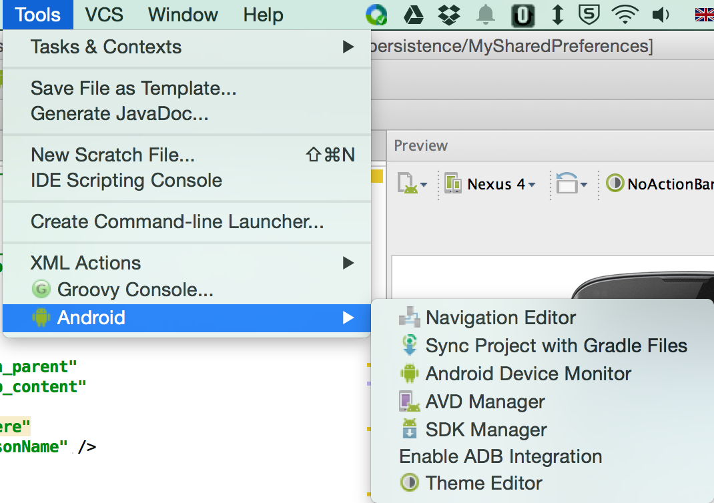
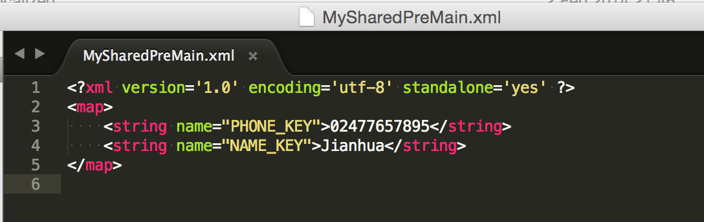

# Data persistence

Data persistence refers to the fact that data need to persist through app life cycle changes. In other words, even if you close the app completely the data need to be restored when the user navigates back to the app. There're serveral ways to save data in Android. In the 1st lab we'll look at using SharedPreferences and File APIs. In the 2nd lab we'll see how to save data using SQL databases.

The most common mistake people make when demonstrating data persistence is that they press the Home button when they finish saving data and then tap the app incon again to bring the app back. NO! That's NOT how you demonstrate data persistence! The proper way of doing it is, after saving your data, you close the app completely using app switcher e.g. the square icon for Nexus devices and then start your app again by tapping the icon.

To understand why this is the case we need to remind ourselves about Activity Lifecycle. What happens when you press the Home button is `onPause()` => `onStop()`. In onctrast, what happens when you press the Back button is `onPause()` => `onStop()` => `onDestroy()`. In other words, when a user clicks the Back button, they are telling Android that they are done with the activity. Android will destroy the Activity. In contrast, when the user clicks the Home button the activity is merely placed into the background – Android will not kill the activity.

## Lab 1 SharedPreferences and files

### SharedPreferences

SharedPreferences is a way to save simple key-value pairs. In fact, the file produced by SharedPreferences API is a plain xml file similar to the resource files you provide for the system. 

Follow steps below to prepare the layout xml file:

1. Start a new Android Studio project and name it 'My SharedPreference'. In content_main.xml, change RelativeLayout to LinearLayout, add `android:orientation="vertical"`.
2. In the Design view, drag and drop the following items onto the layout in the order of: Person Name, Plain TextView and Phone. All these three go below the 'Hello World' TextView that was automatically generated by the system.
3. Double click on the first TextView and change the text to Name, and id to name. Double click on the second TextView and change the text to Phone number, and id to phone.
4. Double click on the first EditText and delete the 'Name' string (leave it empty), and change the id to nameText. For the second EditText, change the id to phoneText.
5. Switch to the Text view and add `android:hint="Enter name here"` for EditText 'nameText' and `android:hint="Enter phone number here"` for EditText 'phoneText' respectively. 
6. Swtich to Design view, drag and drop a Button onto the layout, align to the right of the screen. Set the text as Save, id as button. The finished layout file should look like below:
    
    

Next, we need to use SharedPreferences API to save some simple data.

1. Open MainActivity.java file and insert the following declarations immediately after the class declaration:
    
    ```java
    private EditText editTextName;
    private EditText editTextPhone;
    public static final String NAME_KEY = "NAME_KEY";
    public static final String PHONE_KEY = "PHONE_KEY";
    private SharedPreferences sharedPreferences;
    ```
    
    Here we initialized two EditText objects that hold the user inputs, and two static strings we're going to use as keys in the key-value pairs. 
2. Modify the `onCreate()` method to match the following:
    
    ```java
    @Override
    protected void onCreate(Bundle savedInstanceState) {
        super.onCreate(savedInstanceState);
        setContentView(R.layout.activity_main);
        
        editTextName = (EditText) findViewById(R.id.nameText);
        editTextPhone = (EditText) findViewById(R.id.phoneText);
        sharedPreferences = getSharedPreferences("MySharedPreMain", Context.MODE_PRIVATE);
        
        if (sharedPreferences.contains(NAME_KEY)) {
            editTextName.setText(sharedPreferences.getString(NAME_KEY, ""));
        }
        
        if (sharedPreferences.contains(PHONE_KEY)) {
            editTextPhone.setText(sharedPreferences.getString(PHONE_KEY, ""));
        }
        
    }
    ```
    
    There're several methods offered by the SharedPreferences class, here we used `contains()` and `getString()` method to test if the SharedPreferenes object contains a specific key. If it does, we'll get the data out.
    
3. Create a call-back method that responds to the click event of the only button, as in the code below. Don't forget the `commit()` method! We also need to update the xml file to associate the button with this method by inserting `android:onClick="save"` line into the xml.
    
    ```java
    public void save(View v){
        SharedPreferences.Editor editor = sharedPreferences.edit();
        editor.putString(NAME_KEY, editTextName.getText().toString());
        editor.putString(PHONE_KEY, editTextPhone.getText().toString());
        editor.commit();
        Toast.makeText(this,"data saved",Toast.LENGTH_SHORT).show();
    }
    ```
   
4. Run the app and type in something, then click the 'Save' button. Close the app properly using app switcher, then re-open you'll the data is still there.
    
    
    
    
    
5. To actually see the file that was created, you'll need to run the app using an AVD. If in the previous step you used a real device, now change it to an AVD and save some data in the app. Open Android Device Monitor under the Tools menu.
    
    > If you do it on a real device, you'll see that data folder is empty. That's because you don't have the admin a.k.a. root previledges to access contents in that folder. You could 'root' your device in a way similar to jailbreaking iPhones, but this is not recommended as it opens security holes.
    
    
    
    In the File Explorer tab, go to Data ==> Data ==> com.example.jianhuayang.mysharedpreferences ==> shared_prefs folder, you'll see an xml file named 'MySharedPreMain.xml', which is the name we gave earlier in the `getSharedPreference()` method. This is where your data were saved. Single-click on that xml file to select it, then click the Get Device File icon (the left-most icon in the toolbar) to export the file to your hard drive. 
    
    
    
    If you open the file in a text editor, you'll see the contents. Note that key-value pairs are being stored as texts in it.
    
    
    
    > To see why you shouldn't root your device, read this [blog](http://resources.infosecinstitute.com/android-hacking-security-part-9-insecure-local-storage-shared-preferences/) written by Srinivas, where SharedPreferences were used to manipulate game scores.

### Writing and reading to files

In stead of writing to an internal xml file using SharedPreferences API, you could also use the standard Java IO API to read/write files as if Android is a small PC. 

> In case you need to gain a better understanding of Java I/O, have a look at the [Java I/O Tutorials](https://docs.oracle.com/javase/tutorial/essential/io/) and [how to read data from InputStream into String in java](http://howtodoinjava.com/2013/10/06/how-to-read-data-from-inputstream-into-string-in-java/). 

Follow steps below to create a simple app that stores some data in a file.

1. Locate the 'My SharedPreference' project you created earlier on your hard drive, make a copy of it and rename the new folder to 'MyFiles'.
2. Open content_main.xml, in the Design view drag and drop a LinearLayout (Horizontal) before the Button. 
3. Switch to the  Text view, move the Button definition into this newly created LinearLayout. 
4. Switch back to the design view, drag and drop another button to the right of the Save button, and a Plain TextView to the left of the Save button. Now your layout should look like this:
    
    
    
5. Double click on the new button, change the text to Load, and id to load. 
6. Double click on the 'New Text', delete the 'New Text' string so it becomes blank. Switch back to the text view and give this TextView a weight of 1, and width/height of '0dp'. This finished inner LinearLayout should look like below. 
    > What we just did was a trick to align buttons to the right within a vertical linear layout.
    
    
    
7. Open MainActivity.java file, locate and delete the following lines of code
    
    ```java
    public static final String NAME_KEY = "NAME_KEY";
    public static final String PHONE_KEY = "PHONE_KEY";
    private SharedPreferences sharedPreferences;
    ```
    
    and
    
    ```java
    sharedPreferences = getSharedPreferences("MySharedPreMain", Context.MODE_PRIVATE);
    
    if (sharedPreferences.contains(NAME_KEY)) {
        editTextName.setText(sharedPreferences.getString(NAME_KEY, ""));
    }
    
    if (sharedPreferences.contains(PHONE_KEY)) {
        editTextPhone.setText(sharedPreferences.getString(PHONE_KEY, ""));
    }
    
    ```
    
    and finally
    
    ```java
    SharedPreferences.Editor editor = sharedPreferences.edit();
    editor.putString(NAME_KEY, editTextName.getText().toString());
    editor.putString(PHONE_KEY, editTextPhone.getText().toString());
    editor.commit();
    ```

8. In order to use file input/output, we need to declare some variables. The declaration goes together with EditeText declaration
    
    ```java
    private EditText editTextName;
    private EditText editTextPhone;
    public static final String FILE_NAME = "contacts.txt";
    private File file;
    private FileOutputStream outputStream;
    private FileInputStream inputStream;
    ```
    
9. Inside the `onCreate()` method insert a line to initialize the file object:
    
    ```java
    file = new File(this.getFilesDir(), FILE_NAME);
    ```
    
    This will create a new file at the system default location for your app with the given file name.
    
10. Modify the `save()` method, so it looks like below
    
    ```java
    public void save(View v) {
        String data = editTextName.getText().toString() + "|" + editTextPhone.getText().toString();
        try {
            outputStream = new FileOutputStream(file);
            outputStream.write(data.getBytes());
            outputStream.close();
            Toast.makeText(this, "data saved", Toast.LENGTH_SHORT).show();
        } catch (Exception e) {
            e.printStackTrace();
        }
    }
    ```
    
    What we did here is to get the texts in name and phone fields and connect them using the character '|'. Choosing this character as delimiter is arbitrary, but you need some special characters i.e. those not often seen in names and phone numbers so that parsing the data back is easier. Anything concerns InputStream/OutputStream (FileInputStream/FileOutputStream are sub-classes of these) should be closed properly, and need to be enclosed within try/catch block.
    
11. Create a new method called `load()`, using the following lines of codes:
    
    ```java
    public void load(View v) {
        int length = (int) file.length();
        byte[] bytes = new byte[length];
        try {
            inputStream = new FileInputStream(file);
            inputStream.read(bytes);
            inputStream.close();
            String data = new String(bytes);
            editTextName.setText(data.split("\\|")[0]);
            editTextPhone.setText(data.split("\\|")[1]);
            Toast.makeText(getBaseContext(), "data loaded", Toast.LENGTH_SHORT).show();
        } catch (Exception e) {
            e.printStackTrace();
        }
    }
    ```
    
    From the file object we created in the `onCreate()` method, we get the total number of bytes. Using this number we then define an array to hold all bytes. And then we read every bytes in one go and convert them into a String so that we can assign these texts to different widgets.
    
12. Open ontent_main.xml file and associate this `load()` method with the Load button. Job done! Run this app in an AVD and type some info such as those in the screenshot below, and click save. Close your app and re-open it, if you click the Load button your data will be retrieved.
    
    
    
    As in the Shared Preferences example, the file you saved can be found through the Device Monotor. You can pull the file onto your local hard drive to have a look at its contents.

## Lab 2 SQLite Databases

SharedPreferences and File storage are mainly for data of small quantity. If you have a large amount of data the chance is that you'll need to use SQLite database.

SQL in 5 minutes
For those of you who aren’t familiar with SQL syntax, go to the following address, http://www.w3schools.com/sql/trysql.asp?filename=trysql_select_all, and type in the following in order:

CREATE TABLE contacts (
   id INT PRIMARY KEY     NOT NULL,
   name          TEXT    NOT NULL,
   age           INT,
   address       CHAR(50)
);

INSERT INTO contacts (id, name, age, address) VALUES (1, 'Paul', 22, 'Singer Hall');
INSERT INTO contacts (id, name, age, address) VALUES (2, 'John', 23, 'Singer Hall');
INSERT INTO contacts (id, name, age, address) VALUES (3, 'Ben', 23, 'Callice Court');

SELECT * FROM contacts WHERE id = 2;

Have a play around and make sure you understand everything, as these are important for the following steps. In case that you’re not sure about anything, go to http://www.w3schools.com/sql/ and click the links to the left of the page to read more.

SQLite database
Start a new Android Studio project and name it ‘My SQLite’. Following all default options to create a MainActivity.java class and an activity_main.xml file. 
Contact Class
In Android Studio, right click on your package’s ‘java’ folder (not the test one), select NewJava Class to create a new class. Choose ‘…/app/src/main/java’ as the directory and name it Contact.


Android Studio will create an empty class that looks similar to below:


Now, modify your class to make it look like the following (left figure):

       

Position your mouse so that the cursor is after the constructor but still within the class definition (that is, just before the last curly brackets). On the menu bar, select CodeGenerate…Getter and Setter and select all three member variables. This will generate getter/setter methods for your member variables (right figure above).

DB handler
Following steps similar to the previous one to create a new class called DatabseHandler.java. Modify the class definition to extend SQLiteOpenHelper. You class should now look like:


If you move your mouse over the line highlighted in red underline you’ll see that we need to implement some abstract methods in order to inherit. This is also confirmed from the online manual at http://developer.android.com/reference/android/database/sqlite/SQLiteOpenHelper.html:


Insert the following code into the class to implement the two abstract methods:


Now what you’ll see is that even though you implemented the two abstract methods, there’s still an error saying no constructor available. So let’s insert a constructor for it:


This eliminates the error message, but still the onCreate method is empty. Insert codes into the method so it looks like the following:


Here ‘col’ means column, but it can be anything (just a name). If you follow along the online tutorial written by Ravi Tamada you’ll find that our tutorial is a lot simpler. This is because SQLite allow several different ways of creating a table. For example, every statement that is not on the ‘straight line’ in the image below can be safely ignored.


Detailed documentation on this is online at https://www.sqlite.org/lang_createtable.html. 

Add contacts
In order to have functional storage, you need to read/write to it. In terms of SQL database, this is CRUD i.e. create, read, update, and delete.

To insert data into the database, you need the following method:


Now note that our implementation of the addContact method is different from the online tutorial. I have explained insert method in the lectures – what comes back from it is the row id if it’s successful, or -1 if it failed.

The layout file
Open your xml file (should be only one), change the layout from RelativeLayout to LinearLayout, add vertical orientation, and delete the helloworld TextView.

Next insert the following code into the xml so it looks like the following:

 this is followed by 

The actual layout looks like 


Test your activity
Open your MainActivity.java file and define these variables:


Next, create a method called save:


You’ll need to associate this method with the save button in the xml file. Until this point, you should be able to test the addContact() method. Now, run this app in AVD and insert some texts and click save, what you’ll see is that there’s a log entry produced:

  
Verify the results
Open the Android Device Monitor, locate the SQLite database you just created. Export this file to your hard drive.


Download a tool called SQLiteStudio from http://sqlitestudio.pl. Double click to open it. Next, drag and drop the database you exported into the database window. Locate TablescontactTable and double click it. In the table view click the Data tab. Now you’ll see the data you just created.

      


## Lab 3 Advanced topics

### Array data using SharedPreferences

Typically SharedPreferences APIs are designed to handle simple key-value pairs. But it can be configured to handle arrays as well. Consider the following code example, taken from [StackOverFlow](http://stackoverflow.com/questions/3876680/is-it-possible-to-add-an-array-or-object-to-sharedpreferences-on-android).  

```java
// to save string array
public boolean saveArray(String[] array, String arrayName, Context mContext) {   
    SharedPreferences prefs = mContext.getSharedPreferences("preferencename", 0);  
    SharedPreferences.Editor editor = prefs.edit();  
    editor.putInt(arrayName +"_size", array.length);  
    // replace \ with angle bracket
    for(int i=0;i\array.length;i++)  
        editor.putString(arrayName + "_" + i, array[i]);  
    return editor.commit();  
} 
    
// to retrieve string array
public String[] loadArray(String arrayName, Context mContext) {  
    SharedPreferences prefs = mContext.getSharedPreferences("preferencename", 0);  
    int size = prefs.getInt(arrayName + "_size", 0);  
    String array[] = new String[size];  
    // replace \ with angle bracket
    for(int i=0;i\size;i++)  
        array[i] = prefs.getString(arrayName + "_" + i, null);  
    return array;  
}  
```

* What will happen if the array size changes e.g. reduced?

### External storage

What you have done in lab 1 is to use internal storage. What can also be done is to use external storage i.e. SD card. The procedures are pretty much the same. The only two differences are:

1.	You’ll need to add permissions in manifest.
2.	You’ll need to check the status Environment.getExternalStorageState().


* Can you change the example in lab 1 so that the sytsem write to external storage?


